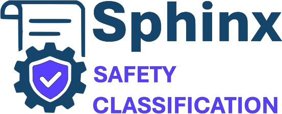
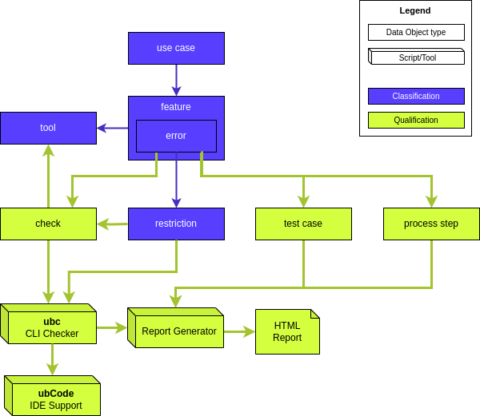

## Classifications for Sphinx, Extensions and related tools

Qualify your <a href="https://sphinx-doc.org">Sphinx-based </a> documentation toolchain for safety audits required by ISO 26262, IEC 61508, EN 50716, and more.

Visit
<a href="https://safety.useblocks.com">safety.useblocks.com</a>
for the complete documentation.

## License
This documentation is available as Open-Source under 
the MIT License. 

## Installation

1. Check out repo
2. Use `rye` for manageing the Python venv
3. Install Python dependencies: `rye sync`
4. Build docs via: `rye run sphinx-build -a -E -b html . _build/html`
5. Open any browser, for instance via `firefox _build/html/index.html`

## Usage
Please visit our [Usage page](https://safety.useblocks.com/usage/index.html) for more information.

## Contribute
We are happy to retreive PR or issues.
Just us the normal GitHub mechanism to collaborate. 

More details about Contribution can be find on your
[Contribute page](https://safety.useblocks.com/usage/contribute.html).

## Maintainer
This Sphinx Classification documentation is
maintained by

## Data Model
This Classification Documentation 
is using [Sphinx-Needs](https://sphinx-needs.com)
for modeling und documenting the relation of the needed
elements for safe tool executions.

It concentrates on the Classification itself, which
documents mainly tool feature and possible errors during
their execution.

The Qualification aspects are available as a commercial package.
For details please visit our [Qualification Kit ](https://safety.useblocks.com/usage/qualification.html)page.

